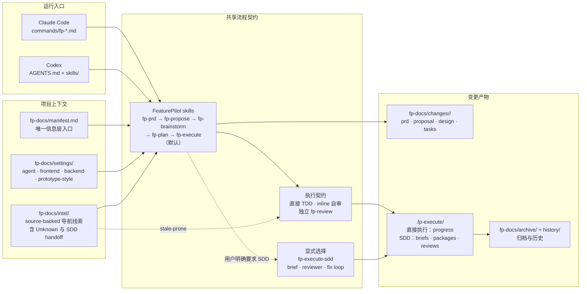

# FeaturePilot (`fp`)

FeaturePilot 是一个 AI 功能开发引导员，覆盖“需求 → 原型/设计 → 计划 → 执行 → 归档”的完整链路。

当前版本（`0.3.0`）同时提供 Claude Code 与 Codex 插件能力，并保留 Codex 可直接读取的 Markdown/AGENTS.md fallback；统一使用 `fp-*` 命名。

## 0.3.0 发布重点

- **PRD interview gate 强化**：普通想法、功能请求、用户故事、痛点或粗略需求本身不会自动触发 PRD 编写。写文件前必须完成确认摘要并获得用户明确批准；Bucket A/B 已确定项批量审阅，Bucket C 待确认项逐个问答，助手建议不等于用户确认。
- Use fp-prd only when the user explicitly invokes /fp-prd or $fp-prd, or explicitly asks to create, write, revise, or complete a PRD or product requirements document.
- **Prototype-first PRD 流程**：UI-heavy 或明确要求“先看原型”的需求，可先确认 prototype-blocking 问题并生成 `prototype.html`，用户确认后再沉淀 PRD。
- **Lazy context 与 stale intel 规则**：默认只读 `fp-docs/manifest.md` 和最小相关 settings/intel；`fp-docs/intel/*` 只作为可能过期的导航线索，涉及当前实现时必须回到当前代码验证。
- **紧凑优先（compact-first）的互斥（mutually exclusive）产物形式**：PRD、proposal、单端 design 与单端 plan 默认使用 small form；只有预计越过 500 行或 30,000 字符硬限制、用户明确批准或目标项目设置明确要求时才使用 split form。
- **过程文档默认中文**：叙述性内容默认使用中文，代码、命令、路径、技术标识符、API 字段及精确 schema 关键词保留必要英文；当前用户明确语言指令优先于目标项目设置。
- **Claude Code + Codex 双入口**：Claude Code 使用插件清单、命令与 Skill tool；Codex 通过 `AGENTS.md` 和 `skills/*/SKILL.md` 读取同一套阶段门禁。

## Claude Code 插件结构

- `.claude-plugin/plugin.json`：Claude Code 插件清单。
- `.claude-plugin/marketplace.json`：本地开发插件市场。
- `.codex-plugin/plugin.json`：Codex 插件清单，加载同一套 `skills/`。
- `commands/`：Claude Code 斜杠命令。
- `skills/`：FeaturePilot 流程技能。

## 核心命令

| 命令文件 | 用途 |
|---|---|
| `commands/fp-init.md` | 初始化 `fp-docs/` 信息层（`manifest.md`、可选 `settings/agent.md`/`frontend.md`/`backend.md`/`prototype-style.md`、`intel/`）；检测到 Canway/CW 项目且用户确认时，可采用标注示例规范 |
| `commands/fp-explore.md` | 只读调查当前代码事实、行为、约束、风险和可选方案；支持空输入的有界项目概览，不创建产物、不进入实现 |
| `commands/fp-prd.md` | 仅在明确调用或明确要求编写 PRD 时启动访谈；支持 Prototype-first 先出 `prototype.html` 再沉淀 PRD |
| `commands/fp-start.md` | 接住 PRD 或需求描述，启动“提案 → 设计 → 计划 → 执行 → 归档”完整链路 |
| `commands/fp-propose.md` | 仅生成并确认开发提案的逻辑形式：小型 `proposal.md` 或拆分 `proposal/00-index.md` 及其 manifest 分片 |
| `commands/fp-brainstorm.md` | 基于已确认提案生成技术设计 |
| `commands/fp-quick.md` | 快速处理无需完整文档链路的小型需求 |
| `commands/fp-review.md` | 归档前最终整分支只读审查 |
| `commands/fp-archive.md` | 归档已完成的变更 |
| `commands/fp-figma.md` | UI / Figma 设计稿分析入口 |

## 核心技能

- `fp-init`：初始化 `fp-docs/` 信息层，并可选引导生成 `fp-docs/settings/agent.md`、`frontend.md`、`backend.md`、`prototype-style.md`；检测到 Canway/CW 项目且用户确认时，可采用 `examples/canway-cw/fp-docs/settings/` 标注示例。
- `fp-explore`：公共自然语言探索入口，也是 `fp-prd`、`fp-start`、`fp-quick` 的共享只读调查能力；内部调用使用结构化 profile，但产品决策、确认、写入和实现始终由调用方负责。
- `fp-prd` / `fp-prd-grill-me`：显式 PRD 编写意图下的需求澄清；支持默认 PRD-first 与 Prototype-first（先生成 `prototype.html`，确认后再沉淀 PRD）。
- `fp-start`：完整阶段门禁调度入口，可以接住 `fp-prd` 产出的 PRD。
- `fp-propose`：生成 `fp-docs/changes/<slug>/proposal.md` 或 `fp-docs/changes/<slug>/proposal/00-index.md` 及其 manifest 分片，两种形式互斥。
- `fp-brainstorm`：生成后端/前端技术设计。
- `fp-plan` / `fp-plan-backend` / `fp-plan-frontend`：生成细粒度 TDD 执行计划。
- `fp-execute`：默认执行入口，在当前上下文按 TDD 直接完成已确认计划，每个任务只做一次 inline 自审。
- `fp-execute-sdd`：用户明确需要 fresh implementer/reviewer、任务隔离和多轮审查时使用的 SDD 执行模式。
- `fp-review`：最终整分支审查。
- `fp-archive`：归档变更。

## 架构图



两种入口共享同一套 Markdown 流程契约：Claude Code 通过命令进入，Codex 通过 `AGENTS.md` 和技能文件进入。`fp-docs/manifest.md` 是项目级信息层唯一入口，`settings/` 提供项目规则，`intel/` 只提供带新鲜度边界的导航信息；实际实现事实仍以当前代码、测试和命令输出为准。

上下文效率采用三层设计：`commands/` 只做薄入口和 gate checksum；所有 skill 每条工作流只加载一次 `skills/_shared/workspace-rules.md`；PRD、proposal、design、plan、review 模板只在对应写入门禁通过后加载。运行 `scripts/measure-context.ps1` 可查看相对优化前基线的静态上下文降幅。

## 借鉴 OpenSpec 的设计

FeaturePilot 吸收了 OpenSpec 中低仪式感、适合存量项目的设计，但把命令聚焦在 AI 功能开发流程上：

- **低成本初始化**：`/fp-init` 只创建最小 `fp-docs/` 目录；配置文件不是必须的。
- **以变更目录作为审查单元**：每个功能放在 `fp-docs/changes/<slug>/` 下，PRD、提案、设计、任务、执行记录和审查都在同一个目录中。
- **产物依赖图，而不是重流程**：推荐路径是 `PRD → 提案 → 设计 → 任务 → 执行`，但已有产物会被复用，不会强迫重复访谈。
- **归档保留历史**：完成后的变更移动到 `fp-docs/archive/YYYY-MM-DD-<slug>/`，并在 `fp-docs/history/history.md` 中记录为什么做、做了什么。

## 低成本使用流程

FeaturePilot 的默认使用方式尽量轻量。完整用户指南见 [`docs/user_guide/init-prd-start.md`](docs/user_guide/init-prd-start.md)：

1. **可选探索**：运行 `/fp-explore <问题>` 调查当前实现或比较方案；空输入只做有界项目概览。探索不创建 FeaturePilot 产物，也不修改代码。
2. **可选初始化**：运行 `/fp-init`，创建 `fp-docs/`，并可选生成 `fp-docs/settings/agent.md`、`frontend.md`、`backend.md`、`prototype-style.md`；如检测到 Canway/CW 项目，只有在用户确认后才可采用 `examples/canway-cw/` 示例规范作为项目 settings 草稿。
3. **需求设计**：当你确实要创建、编写、修订或补全 PRD 时，显式运行 `/fp-prd <想法>`；完成确认后写入 PRD 的小型或拆分形式。如果明确希望先看页面/交互，可走 Prototype-first，先生成并确认 `prototype.html` 后再沉淀 PRD。
4. **开发接续**：运行 `/fp-start <slug>`，读取 PRD，生成开发提案，然后继续进入设计、计划、执行、审查和归档。计划确认后的默认执行入口是 `fp-execute`。
5. **无配置也可运行**：如果没有 `agent.md`，FeaturePilot 会基于当前代码、相邻实现和用户回答继续工作。

只有用户明确要求 `fp-execute-sdd`、SDD 或 fresh implementer/reviewer 隔离时，`fp-start` 才进入复杂模式；不会仅根据计划规模或风险自动切换。该模式会使用任务说明、全新上下文实现代理、逐任务审查、修复循环和最终整分支审查。

## 项目配置

FeaturePilot 是公共插件，不内置任何客户组件库、设计系统、仓库结构或审查策略。目标项目如需定制行为，可以在自己的 `fp-docs/settings/agent.md`、`fp-docs/settings/frontend.md`、`fp-docs/settings/backend.md`、`fp-docs/settings/prototype-style.md` 中声明。

```text
fp-docs/
  manifest.md                 # FeaturePilot 信息层唯一入口
  settings/
    agent.md                  # 可选：轻量 FeaturePilot policy adapter
    frontend.md               # 可选：前端/UI/视觉/设计系统规则
    backend.md                # 可选：后端/API/数据/安全规则
    prototype-style.md        # 可选：原型视觉风格参考
  intel/                      # 生成的 source-backed 但 stale-prone 的导航线索
```

规则：

- 如果 `fp-docs/manifest.md` 存在，Agent 必须先读取它，再按 manifest 发现相关 settings 和 intel。
- 如果没有配置文件，Agent 回退到当前代码、相邻实现和公共默认规则。
- 客户项目应通过 `fp-docs/settings/` 定制规则，而不是修改公共插件源码。
- 公共插件不得假设任何客户组件库、供应商、组件前缀、设计 token、后端框架或工作流策略。

## 输出目录

FeaturePilot 生成的文档统一放在目标项目的 `fp-docs/` 下。`fp-docs/changes/<slug>/` 中每个逻辑产物只能选择一种 canonical form：

| 逻辑产物 | 小型形式 | 拆分形式 |
|---|---|---|
| PRD | `prd.md` | `prd/00-index.md` 加 manifest 中列出的分片 |
| Proposal | `proposal.md` | `proposal/00-index.md` 加 manifest 中列出的分片 |
| Backend design | `design/backend.md` | `design/backend/00-index.md` 加 manifest 中列出的分片 |
| Frontend design | `design/frontend.md` | `design/frontend/00-index.md` 加 manifest 中列出的分片 |
| Backend plan | `tasks/plan-backend.md` | `tasks/backend/00-index.md` 加 manifest 中列出的分片 |
| Frontend plan | `tasks/plan-frontend.md` | `tasks/frontend/00-index.md` 加 manifest 中列出的分片 |

产物形式采用紧凑优先（compact-first）且 small/split 互斥：预计完整逻辑产物不超过 500 行和 30,000 字符时默认使用 small form；只有预计超过任一硬限制、用户明确批准 split form，或目标项目设置明确要求 split form 时才拆分。功能、子系统、页面区域、任务组或 ownership domain 只用于拆分后的语义边界，不单独触发拆分。

FeaturePilot 过程文档的叙述性内容默认使用中文；代码、命令、路径、技术标识符、API 字段和契约要求精确匹配的 schema 关键词保留必要英文。当前用户明确语言指令优先于目标项目设置。

每个 Markdown 文件（包括 index 与 fragment）继续执行 500 行和 30,000 字符双重硬上限；超过任一硬限制就继续按语义拆分。

整体目录如下；竖线表示二选一，不允许同时生成：

```text
fp-docs/
  manifest.md                     # FeaturePilot 信息层唯一入口
  settings/                       # 仅 fp-init 创建，非必须
    agent.md                      # 可选：轻量 FeaturePilot policy adapter
    frontend.md                   # 可选：前端/UI/视觉/设计系统规则
    backend.md                    # 可选：后端/API/数据/安全规则
    prototype-style.md            # 可选：原型视觉风格参考
  intel/                          # 仅 fp-init 创建，source-backed 但 stale-prone 的导航线索
  changes/<slug>/                 # 按需由各阶段创建
    prd.md | prd/00-index.md
    proposal.md | proposal/00-index.md
    design/
      00-index.md                  # 只列实际存在的端及其 canonical entrypoint
      backend.md | backend/00-index.md
      frontend.md | frontend/00-index.md
    tasks/
      00-overview.md                # 仅当前后端与前端计划都存在时生成；无 task checkbox
      plan-backend.md | backend/00-index.md
      plan-frontend.md | frontend/00-index.md
    .fp-execute/
      progress.md                  # 直接执行与 SDD 共用的恢复证据
      briefs/                      # 仅 SDD
      packages/                    # 仅 SDD
      reviews/                     # 独立 fp-review 或 SDD review
  archive/                      # 由 fp-archive 自动创建
  history/history.md             # 由 fp-archive 自动创建
```

`design/00-index.md` 只是 change-level 端映射。`tasks/00-overview.md` 是 two-end-only overview：只在后端和前端计划同时存在时生成；单端计划无论小型还是拆分都不能有 overview。双端 overview 只保存两端 canonical entrypoint、跨端依赖/阶段，以及从唯一 owner checkbox 派生的进度总数。每个 `backend-NNN` / `frontend-NNN` 任务只有一个真实 checkbox，位于小计划文件或一个 `tasks` kind 分片中；端内 index、context/interface/coverage 分片和 `.fp-execute/progress.md` 都不是第二份完成状态。

Consumer 先检测 canonical 小型文件与 split directory 的 `00-index.md`，再按 manifest 顺序读取，不能依赖递归 glob、文件系统顺序或正文链接。There is no read-only compatibility：根级 `design-backend.md` / `design-frontend.md`、任何 design/task stable-file-plus-directory pair、`prd.md` 与 `prd/` 并存、`proposal.md` 与 `proposal/` 并存，在 Producer 和 Consumer 中都属于结构冲突。继续前必须经明确批准迁移到唯一 canonical form 并删除 obsolete paths。

## 本地安装测试（Claude Code）

在 Claude Code 中添加本仓库作为开发插件市场：

```text
/plugin marketplace add <path-to-feature-pilot>
/plugin install fp@fp-dev
```

重启 Claude Code 后使用命令，例如：

```text
/fp-init
/fp-explore 当前审批流的入口和权限边界是什么
/fp-prd 我想做一个批量审批体验优化
/fp-start <prd-slug 或 功能描述>
```

维护者可在修改命令或技能后运行仓库一致性校验：

```powershell
powershell -ExecutionPolicy Bypass -File .\scripts\validate-plugin.ps1
```

## Codex 使用方式

Codex 可通过 `.codex-plugin/plugin.json` 安装 FeaturePilot，并从同一仓库加载 `skills/`。本地开发安装使用 personal marketplace：把插件源同步到 `~/plugins/fp`，确保 `~/.agents/plugins/marketplace.json` 包含 `fp` 本地条目，然后执行 `codex plugin add fp@personal`；重装后新建任务以加载最新技能。

`/fp-*` 仍是工作流标签，不是 Claude Code 斜杠命令。安装后可直接要求 Codex 使用 `fp:fp-start`、`fp:fp-prd` 等技能；未安装插件时，也可以读取本仓库 `AGENTS.md` 和同名 skill 作为 fallback。

Codex 执行时应先读取匹配 skill，再遵循与 Claude Code 相同的阶段门禁：
   - `fp-prd` 必须先完成 PRD interview gate；Prototype-first 必须先确认原型再写 PRD；
   - 提案确认后才能设计；
   - 设计确认后才能计划；
   - 计划确认后才能执行；
   - 完成后执行审查，再归档。

Codex 同样必须使用 lazy context：不要批量读取 `fp-docs/settings/`、`fp-docs/intel/`、历史 changes/archive/history；generated intel 只是导航线索，不是当前事实来源。

## 当前版本范围

已包含（`0.3.0`）：

- 初始化：`fp-init`。
- 需求设计：`fp-prd`、`fp-prd-grill-me`、`fp-grill-me`、`fp-propose`、`fp-brainstorm`；包含 PRD-first、Prototype-first、PRD interview gate、mandatory PRD template、prototype style extraction/lazy consumption。
- 完整启动链路：`fp-start` 及其依赖的 `fp-plan`、`fp-execute`、`fp-execute-sdd`、`fp-review`、`fp-archive`。
- 信息层规则：`fp-docs/manifest.md` 作为索引入口；settings/intel 按需最小读取；generated intel 视为 stale-prone navigation，当前事实必须用当前代码验证。
- Claude Code / Codex 双入口：插件运行时与 Markdown 技能说明保持同一套阶段门禁。

未包含独立 TypeScript CLI；第一版优先交付 Claude Code 原生插件与 Codex 可读流程文档。
