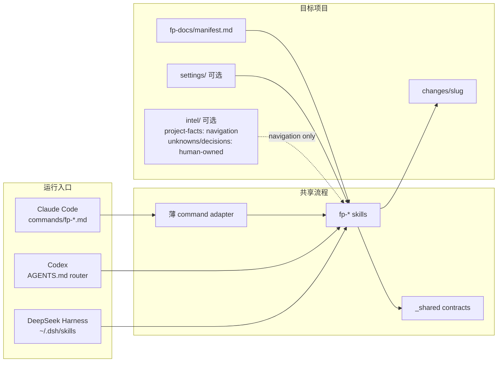

# FeaturePilot 架构与产物参考

本文面向希望理解 FeaturePilot 内部结构、信息层和证据模型的开发者。它是人类可读的技术说明；Agent 执行时仍以 [`skills/`](../../skills/) 和 [`skills/_shared/`](../../skills/_shared/) 中的运行时契约为准。

## 一张图看懂三端架构



三种运行时共享同一套 Markdown skill：

- Claude Code 通过 `commands/fp-*.md` 进入；
- Codex 通过根目录 `AGENTS.md` 把意图路由到 skill；
- DeepSeek Harness 从用户技能根加载 `fp-*` 与 `_shared/`。

安装、更新和缓存刷新方式见 [开始使用 FeaturePilot](../getting-started.md)。

## command、skill 与 shared contract

### command：薄入口

`commands/` 只负责接收参数、加载同名 skill，并保留少量 gate checksum。它不拥有完整流程，也不应复制大量规则。

### skill：工作流所有者

每个 `skills/fp-*/SKILL.md` 拥有一个工作流的步骤、门禁、状态和完成条件。例如：

- `fp-start` 调度完整开发主线；
- `fp-execute` 与 `fp-execute-sdd` 执行已确认计划；
- `fp-final-review` 做归档前整分支审查；
- `fp-coverage`、`fp-module-review`、`fp-db-adapter` 负责专项流程。

完整入口选择见 [命令与技能参考](commands-and-skills.md)。

### shared contract：跨流程规则

| 运行时事实源 | 负责内容 |
|---|---|
| [`skills/_shared/workspace-rules.md`](../../skills/_shared/workspace-rules.md) | 项目根、插件资源映射、manifest-first、lazy context、证据优先级、语言和写入所有权 |
| [`skills/_shared/artifact-layout.md`](../../skills/_shared/artifact-layout.md) | canonical form、split manifest、hard limit、任务 owner、Producer/Consumer 校验 |
| [`skills/_shared/decision-ledger.md`](../../skills/_shared/decision-ledger.md) | 提案与设计决策状态、逐项确认、独立写入授权和恢复证据 |
| [`skills/_shared/codegraph.md`](../../skills/_shared/codegraph.md) | CodeGraph 安装、查询、回退、当前源码复核和写后新鲜度 |
| [`skills/_shared/prototype-contract.md`](../../skills/_shared/prototype-contract.md) | 前端能力识别、原生基座/单 HTML 兼容、Mock 隔离、源码/静态资产、版本及保真证据 |
| [`skills/_shared/ui-e2e-contract.md`](../../skills/_shared/ui-e2e-contract.md) | UI Delivery Level、视觉/E2E 生命周期、真实浏览器证据和不可豁免门禁 |

这些 contract 是 Agent 行为的单一事实源。本文解释它们如何协作，不覆盖其精确措辞。

## 项目信息层

FeaturePilot 只在**目标项目仓库根目录**识别 `fp-docs/`。如果 `fp-docs/manifest.md` 存在，所有流程先读它，再读取与当前阶段直接相关的最小子集。

```text
fp-docs/
├── manifest.md
├── settings/                    # 可选，批准具体文件后创建
│   ├── agent.md
│   ├── frontend.md
│   ├── backend.md
│   └── prototype-style.md
└── intel/                       # 可选
    ├── project-facts.md         # generated、stale-prone
    ├── .freshness.json          # metadata-only
    ├── unknowns.md              # human-owned、lazy
    └── decisions.md             # human-owned、lazy
```

### manifest-only default

新项目默认只创建 `fp-docs/manifest.md`。这已经是合法完整的初始化结果：

- settings 不存在时，流程回到当前代码、相邻实现和公共默认；
- project facts 只在用户批准 discovery 后生成；
- human-owned unknowns/decisions 只在确有内容并批准时创建；
- 缺失的可选文件记录为 `N/A`，不是阻塞条件。

### 原生原型基座

有 Web 前端时，可单独运行 `fp-prototype-init` 建立/复用/刷新 `fp-docs/prototype-bases/<app-id>/`：同框架源码、真实组件/样式、Mock、静态 preview 及局部 manifest。fp-init 的可选阶段委托同一技能，不维护第二套流程。无前端跳过；settings/discovery/CodeGraph 批准不自动授权构建或安装。主 manifest 缺失也不强制初始化；若存在，只能在精确 diff 获批后编辑 Prototype Bases 小节。

fp-prd 将本需求原型放在 `changes/<slug>/prototype/`，记录 baseReference，只修改隔离源码并重新构建；与旧 `prototype.html` 互斥。基座刷新不会覆盖已有需求，人工风格设置不自动重写。静态包通过本地服务预览，原型的 Mock 证据不是生产 E2E。

### 已有信息层刷新

再次运行 `fp-init` 且根目录已有 manifest 时，流程进入 `refresh-existing-information-layer`。它根据 `.freshness.json` 的 source fingerprint 与 body hash 实时计算 project facts 的 stale/conflict，展示清单并确认后才刷新；settings、human-owned knowledge、active changes、archive/history 和冲突内容不会被批量覆盖。

### 证据优先级

- 当前行为：当前代码、配置、测试和命令输出；
- 目标行为：已确认 PRD、proposal、design 和 tasks；
- generated intel：只用于定位候选，不能证明当前行为；
- 历史变更与归档：不自动作为当前实现上下文。

## 变更产物与执行证据

每个功能以 `fp-docs/changes/<slug>/` 作为审查单元：

```text
fp-docs/changes/<slug>/
├── prd.md | prd/00-index.md
├── proposal.md | proposal/00-index.md
├── design/
│   ├── 00-index.md
│   ├── backend.md | backend/00-index.md
│   └── frontend.md | frontend/00-index.md
├── tasks/
│   ├── 00-overview.md           # 仅前后端计划都存在
│   ├── plan-backend.md | backend/00-index.md
│   └── plan-frontend.md | frontend/00-index.md
└── .fp-execute/
    ├── progress.md
    ├── briefs/                  # SDD 按需
    ├── packages/                # SDD/终审证据包
    ├── reviews/
    ├── visual/<task-id>/<case-id>/
    └── e2e/<task-id>/<case-id>/
```

`.fp-execute/` 保存恢复和验证证据，但不会成为第二份任务完成权威。计划中的唯一 task-owner checkbox 仍然决定计划状态。

## Canonical small/split 规则

每个逻辑产物只能选择一种 mutually exclusive（互斥）形式：

| 逻辑产物 | Small form | Split form |
|---|---|---|
| PRD | `prd.md` | `prd/00-index.md` + manifest fragments |
| Proposal | `proposal.md` | `proposal/00-index.md` + manifest fragments |
| Backend design | `design/backend.md` | `design/backend/00-index.md` + fragments |
| Frontend design | `design/frontend.md` | `design/frontend/00-index.md` + fragments |
| Backend plan | `tasks/plan-backend.md` | `tasks/backend/00-index.md` + fragments |
| Frontend plan | `tasks/plan-frontend.md` | `tasks/frontend/00-index.md` + fragments |

### compact-first

预计完整逻辑产物不超过 **500 lines** 和 **30,000 characters** 时，默认使用 small form。只有以下情况使用 split form：

1. 预计超过任一 hard limit；
2. 用户明确批准 split form；
3. 目标项目设置明确要求 split form。

功能数、子系统、页面区域、任务组或 ownership domain 只用于已选 split form 的语义分片，不单独触发拆分。每个 index 和 fragment 自身仍受 500 行与 30,000 字符限制。

### Design end map

只要 backend 或 frontend 任一 design end 存在，`design/00-index.md` 就必须存在。它始终是小型 change-level end map，用 `End | Canonical entrypoint | Mode` 列出全部且仅列出实际存在的设计端；它不是 split manifest，也不能替代 `design/backend/00-index.md` 或 `design/frontend/00-index.md`。

### Split manifest

每个 end-specific split directory 的 `00-index.md` 是该逻辑产物的唯一 canonical entrypoint。它用 `Order | File | Kind | Owns` manifest 显式列出所有 sibling fragments；Consumer 按 manifest 顺序读取，不依赖递归 glob、文件系统顺序或正文链接。

计划分片中：

- `context`、`interface`、`coverage` 各有唯一 owner；
- 只有 `tasks` kind fragment 可以拥有可执行 checkbox；
- 每个 `backend-NNN` / `frontend-NNN` ID 和 checkbox 只出现一次；
- `tasks/00-overview.md` 是 two-end-only overview，只在前后端计划同时存在时出现，且只保存跨端依赖、入口与派生进度。

small file 与对应 split directory 并存、缺少 index、漏列 fragment、重复 owner 或历史根级路径都属于结构冲突。There is no read-only compatibility；继续前必须经批准迁移到唯一 canonical form。

## CodeGraph 可选导航层

CodeGraph 是可选加速，不是 FeaturePilot 的前置条件。

### 查询路径

需要代码位置、符号关系、调用链、数据流或影响范围时，按以下顺序选择：

`MCP → CLI → 原生搜索`

图结果始终是 `navigation-hint-only`。关键结论必须回到当前源码、测试、diff 或命令输出复核。CodeGraph 不可用、陈旧、语言不支持或查询失败时，流程直接回退，不阻塞 FeaturePilot。

### 新鲜度生命周期

每个工作流在第一次需要图时最多做一次初始健康检查；发现待同步变化时最多执行一次 `pre-query sync`，同步后不重复检查。首次写入源码、测试、配置、schema 或生成器输入后，图状态变为 `dirty-after-write`：

- 当前工作流不再查询旧图；
- 写后的定位使用原生当前源码搜索；
- 如果工作流开始时已有图，在用户可见返回前最多执行一次单独计数的 `post-write-sync`，即使此前已经执行 `pre-query sync`；
- 同步失败只记录并回退，不影响验证和完成；
- 原来没有图时不会在完成阶段隐式建图。

安装命令、MCP 配置边界和三端同步方式见 [开始使用 FeaturePilot](../getting-started.md)。

## UI/E2E、Figma 与 final review

### UI Delivery Level

每个 UI case 声明一种等级：

- `static-only`：只交付静态呈现；视觉通过后可给出有证据的 E2E `N/A`；
- `interactive`：包含真实用户交互，必须有真实浏览器 E2E；
- `business-flow`：跨越真实业务边界，还必须证明真实 core API、持久化或权限结果与 cleanup。

Visual Evidence Manifest 与 UI/E2E Delivery Contract 是两个独立记录，只通过 `Task ID + Case ID` 关联。截图证明视觉状态，浏览器交互证明行为，二者不能互相替代。

`interactive` and `business-flow` require real browser E2E with a zero-mock rule. A `static-only` E2E `N/A` requires visual evidence and a recorded reason. Core UI/E2E blockers cannot be waived or overridden before archive.

### 浏览器能力

优先复用项目现有 runner、已安装 browser extension 或本机 `playwright-cli`。均不可用时进入 `BROWSER_CAPABILITY_GATE`，由用户选择安装方式或不安装；Never silently install or change the target project's dependencies, lockfile, configuration, CI, or browser components.

required E2E 使用真实目标浏览器和真实业务路径，不用 mock 数据、请求拦截或绕过 UI 的后端写入。核心 UI/E2E gap 不能由 `PASS_WITH_NOTES`、人工批准或归档确认豁免。

### Figma

有可信 Figma UI 设计时，它是 UI 视觉与呈现的源事实；当前代码和真实浏览器用于保护既有功能。FeaturePilot 使用：

- `FIGCAP-*` 记录必须实现的可观察能力；
- `PRES-*` 记录 Figma 未展示但必须保留的既有行为；
- Visual Case 保存 approved reference 与真实 runtime current；
- fresh read-only reviewer 独立判断视觉与能力结果。

没有可信设计源或真实 runtime 证据时，结论是 `CANNOT_VERIFY`，不能宣称改造完成。

### final review

`fp-final-review` 在归档或合并前检查完整分支，而不是只看单个 task：

- canonical artifact 与 task ownership；
- 需求、设计和任务覆盖；
- Scope Matrix 与跨变更 owner；
- command safety 与验证新鲜度；
- 适用的 Visual、Figma 和 UI/E2E gate；
- 当前工作树和完整 diff。

终审只写 review report，不修改实现。详细人类入口见 [命令与技能参考](commands-and-skills.md)。

## 归档与历史

通过全部适用门禁后，`fp-archive` 才会请求移动确认：

```text
fp-docs/archive/YYYY-MM-DD-<slug>/
fp-docs/history/history.md
```

归档移动完整 change 目录，并把目标、变更点和归档路径追加到 history。执行 ledger、review report 或聊天总结都不是第二份归档权威。

## 从 OpenSpec 借鉴了什么

FeaturePilot 借鉴了 OpenSpec 的几个低仪式感原则：

- 以 change directory 作为审查单元；
- 用显式产物依赖，而不是把状态留在聊天中；
- 已有产物可以恢复，不强迫重复访谈；
- 完成后归档并保留“为什么做、做了什么”。

FeaturePilot 在此基础上增加了面向 AI 开发的决策门禁、TDD 执行、证据包、真实 UI/E2E 和多运行时加载。

## 过程文档语言

FeaturePilot 过程文档的叙述内容默认使用中文；代码、命令、路径、技术标识符、API 字段和必须精确匹配的 schema 词保留必要英文。当前用户明确指定的语言优先于目标项目设置。

## 运行时事实源

本文用于理解架构。实现或维护契约时，请直接检查：

- [workspace rules](../../skills/_shared/workspace-rules.md)
- [artifact layout](../../skills/_shared/artifact-layout.md)
- [decision ledger](../../skills/_shared/decision-ledger.md)
- [CodeGraph contract](../../skills/_shared/codegraph.md)
- [UI/E2E contract](../../skills/_shared/ui-e2e-contract.md)

继续阅读：

- [命令与技能参考](commands-and-skills.md)
- [开始使用](../getting-started.md)
- [完整使用主线](../user_guide/init-prd-start.md)
- [返回项目首页](../../README.md)
