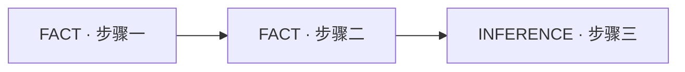

# `fp-eli5` Output Template

只在主题分类完成、仓库主题证据充分、敏感内容已排除，并且已选择实际可用的渲染路径后读取本模板。不得为了使用模板创建文件、启动服务器或扩大调查范围。

## Evidence labels

每个内容单元使用文字标签，不能只依赖颜色：

| Stable label | 默认中文 | 含义 |
|---|---|---|
| `FACT` | 事实 | 当前可靠来源直接支持 |
| `INFERENCE` | 推断 | 由证据推导但未被直接证明 |
| `RISK` | 风险 | 可能导致错误、损失或阻塞 |
| `UNKNOWN` | 未知 | 当前证据不能回答 |
| `ANALOGY` | 类比 | 帮助理解，不是系统事实 |

通用概念没有仓库证据时，明确显示“通用解释；未使用当前仓库证据”，不得伪造路径或引用。

## Story regions

按主题实际需要使用以下区域；不得为了填满模板发明内容：

1. `one-line conclusion` — 一句话结论。
2. `actors or components` — 3–7 个角色或组件。
3. `flow` — 3–6 个有方向的步骤。
4. `analogy` — 最多一个生活化类比，并显示 `ANALOGY` 标签。
5. `failure` — “哪里会出错”，保留原始严重性。
6. `remember` — “只需记住什么”。
7. `evidence` — 可展开的“真实依据”，包含最小必要路径、行号、命令摘要和未确认项。

主题过大时只选一个核心故事，并在 `UNKNOWN` 或未展开范围中列出省略部分。

## HTML artifact

只有宿主明确提供 HTML artifact 能力时，才生成临时单文件视觉结果。仅有 browser、preview、shell 或文件写入能力不等于 artifact 能力。

HTML 结构遵循：

```html
<main aria-labelledby="eli5-title">
  <header>
    <p class="eyebrow">零基础图解</p>
    <h1 id="eli5-title">主题标题</h1>
    <p class="conclusion">一句话结论</p>
  </header>

  <section aria-labelledby="actors-title">
    <h2 id="actors-title">谁在参与</h2>
    <ul class="cards">
      <li class="card" data-evidence="FACT"><span class="label">FACT</span> 角色或组件卡片</li>
    </ul>
  </section>

  <section aria-labelledby="flow-title">
    <h2 id="flow-title">事情怎么发生</h2>
    <ol class="flow">
      <li data-evidence="FACT"><span class="label">FACT</span> 按方向排列的流程步骤</li>
    </ol>
  </section>

  <aside aria-labelledby="analogy-title">
    <h2 id="analogy-title"><span>ANALOGY</span> 类比</h2>
    <p>帮助理解，不是系统事实。</p>
  </aside>

  <section aria-labelledby="failure-title">
    <h2 id="failure-title">哪里会出错</h2>
    <ul>失败、风险、未知或无此项</ul>
  </section>

  <section aria-labelledby="remember-title">
    <h2 id="remember-title">只需记住什么</h2>
    <p>一条最小记忆点</p>
  </section>

  <details>
    <summary>真实依据</summary>
    <ul>带 FACT / INFERENCE / RISK / UNKNOWN 标签的最小证据</ul>
  </details>
</main>
```

视觉要求：

- 大字号、少文字、充足留白和清晰方向；
- 3–7 张卡片，不生成信息墙；
- 高对比度并支持浅色/深色宿主；
- 键盘可聚焦的交互元素和可见焦点；
- `details` / `summary` 使用原生语义；
- CSS、SVG 和必要 JavaScript 全部内联；
- 无 CDN、远程字体、远程图片、外部样式或外部脚本；
- 不执行仓库代码，不插入大段源码；
- 所有来自用户、文件、tool output 的文本先转为纯文本并转义 `&`, `<`, `>`, `"`, `'`；
- `FAIL`、`BLOCKED`、`CANNOT_VERIFY` 和安全风险保留原词，不用柔化文案替换。

## Markdown + Mermaid fallback

没有 HTML artifact 能力时输出信息等价的 Markdown。

### Mermaid-safe labels

- Use generated fixed node IDs such as `N1`, `N2`, `N3`; never derive an ID from user, repository, or tool text.
- Use quoted labels in the form `N1["FACT · safe label"]` and keep the evidence label inside every actor/step node.
- Normalize whitespace and remove line breaks and control characters before encoding a label.
- Escape or replace Mermaid delimiters and quotes; never copy raw source text into diagram syntax.
- Explicitly forbid click, classDef, style, linkStyle, and %% directives, plus `subgraph`, `end`, and `@{` syntax originating from untrusted text.
- Keep labels short. Always fall back to plain text when a label cannot be safely encoded.

````markdown
# 零基础图解：主题标题

> 一句话结论

## 谁在参与
- **组件 A（FACT）**：简短职责
- **组件 B（INFERENCE）**：简短职责

## 事情怎么发生



## ANALOGY：类比
帮助理解，不是系统事实。

## 哪里会出错
- **RISK**：具体风险或 `无`
- **UNKNOWN**：当前未知或 `无`

## 只需记住什么
一条最小记忆点。

<details>
<summary>真实依据</summary>

- **FACT** `path:line` — 最小证据

</details>
````

Mermaid 节点文字必须短，流程方向明确；不要把证据正文塞入节点。

## plain text fallback

Mermaid 也不可呈现时使用纯文本编号流程：

```text
一句话结论

[FACT: 角色 A] -> [FACT: 步骤 1] -> [INFERENCE: 步骤 2] -> [FACT: 结果]

ANALOGY: 帮助理解，不是系统事实。
failure: FAIL / BLOCKED / CANNOT_VERIFY / 风险 / 无
remember: 一条最小记忆点

evidence:
- FACT path:line - 最小证据
- UNKNOWN - 当前缺口
```

三种渲染路径的信息分类、严重性、未知和证据必须一致；降级只改变媒介，不改变结论。
