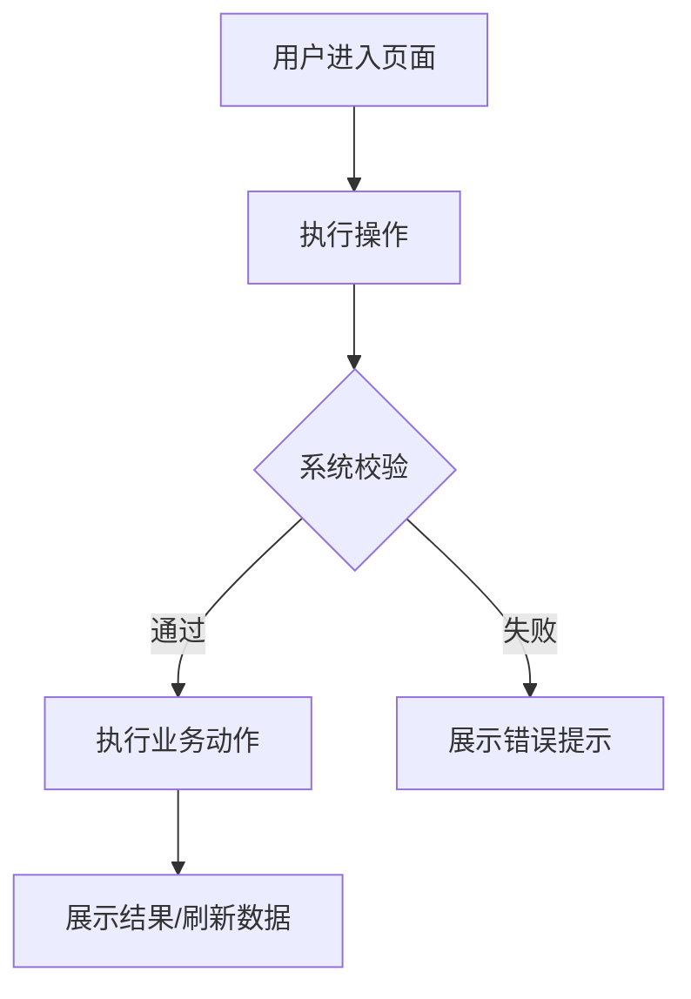

## FeaturePilot workspace and information layer

Before choosing output paths, commands, UI/backend rules, or workflow behavior:

1. Walk upward from the current working directory to find `fp-docs/`.
2. If `fp-docs/manifest.md` exists, read it first.
3. Read only relevant settings and intel listed by the manifest.
4. If UI/frontend is involved and `fp-docs/settings/frontend.md` exists, read it as a required source.
5. If backend/API/data/security behavior is involved and `fp-docs/settings/backend.md` exists, read it as a required source.
6. Treat settings/intel as navigation and constraints; verify exact implementation facts against current code.
7. Use two precedence modes: current code/command output wins for current-state facts; approved change artifacts win for target-state requirements.

Public plugin rule: do not hardcode any customer component library, vendor, component prefix, design token, backend framework, API envelope, or workflow policy in public skills. Customer-specific rules belong in target-project settings.

Compatibility rule: if an older project has no `fp-docs/manifest.md`, continue from current code and existing settings when safe, and recommend `/fp-init` repair/refresh.
---

# FeaturePilot PRD

`fp-prd` turns a product idea, pain point, user story, or rough requirement into a PRD artifact.

It only creates product requirements artifacts:

- `fp-docs/changes/<slug>/prd.md`
- optionally `fp-docs/changes/<slug>/prototype.html`

It must not create `proposal.md`, `design.md`, or `tasks/`, and must not enter implementation.

## Required Interview Skill

Before writing any PRD file, load and follow `fp-prd-grill-me`.

`fp-prd-grill-me` is responsible for questioning, code-fact exploration limits, blocking decisions, recommended answers, answer-format instructions, ambiguity handling, correction handling, and confirmation gates. `fp-prd` is responsible only for the PRD path, template, prototype rules, self-review, and handoff.

## Input

If input is empty, stop and ask the user for one sentence describing an idea, pain point, goal, or user story. Do not explore files or create anything.

Valid inputs include:

- `想给告警列表加负责人筛选`
- `作为运维人员，我想批量重启主机，以便快速处理故障`
- `发布失败后排查很麻烦`
- Semi-structured background, scope, screenshots, Figma links, or reference pages

## Process

1. Load `fp-prd-grill-me`.
2. Use it to confirm all PRD-blocking decisions.
3. Show a confirmation summary and wait for user approval.
4. Generate a kebab-case slug.
5. Write `fp-docs/changes/<slug>/prd.md` using the Mandatory PRD Structure verbatim: exact top-level headings 一 through 六, exact subsection headings, exact table columns, and no extra top-level sections.
6. If a prototype is confirmed as needed, write `fp-docs/changes/<slug>/prototype.html`.
7. Run PRD self-review and report paths.

Do not create directories or write files before the user confirms the interview summary.

If target `prd.md` already exists, do not overwrite silently. Ask whether to overwrite, revise, append, or cancel.

## Mandatory PRD Structure

**严格结构要求：** 生成 `prd.md` 时必须完整保留下方一级/二级/三级标题及顺序，不得改名、合并、跳过或重排章节。没有内容的章节也必须保留，并写明“不适用”或“无，原因：...”。

硬性要求：

- 顶部标题必须是 `# <产品/功能名称> PRD`。
- 必须包含并按顺序输出：`一、用户故事`、`二、核心业务流程`、`三、功能需求`、`四、非功能需求`、`五、测试建议`、`六、待确认问题`。
- `三、功能需求` 下每个功能都必须包含：功能说明、交互逻辑、异常处理、页面元素、原型。
- 表格列名必须保持模板一致；可新增行，不能删除列。
- 复杂交互必须提供 mermaid；简单功能也必须在第二章说明为什么无需流程图。
- `待确认问题` 只能记录非阻塞问题；如果没有，写“无”。
- 写入后必须按“结构自检清单”逐项检查，缺任何标题或表格都要立即修正。

````markdown
# <产品/功能名称> PRD

## 一、用户故事

### 1.1 用户故事

- 作为 <使用角色>，我想要 <能力/动作>，以便于 <业务价值>。

### 1.2 业务问题与预期目标

<业务问题、当前痛点、预期目标和成功状态。>

## 二、核心业务流程

<!-- 简单功能可说明无需流程图；复杂交互必须给 mermaid。 -->



## 三、功能需求

### 3.1 <功能名称>

#### 3.1.1 功能说明

<该功能做什么，解决哪个用户故事。>

#### 3.1.2 交互逻辑

- 用户点击 <操作>，系统显示 <反馈/弹窗/页面>。
- 用户输入 <内容>，系统执行 <校验/查询/提交>。
- 用户确认 <动作>，系统 <调用接口/刷新状态/记录日志>。

#### 3.1.3 异常处理

| 异常场景 | 触发条件 | 系统处理方式 | 用户提示 |
|---|---|---|---|
| <异常场景> | <条件> | <处理方式> | <提示文案> |

#### 3.1.4 页面元素

| 元素名 | 类型 | 说明 | 校验规则 |
|---|---|---|---|
| <元素名> | <输入框/选择器/按钮/表格/弹窗/其他> | <用途> | <必填/格式/长度/权限/状态> |

#### 3.1.5 原型

- 原型文件：`prototype.html`（如生成）
- 原型依据：<已有页面 / Figma / 截图 / UI/UX spec>
- 未生成原因：<如不需要原型>

## 四、非功能需求

### 4.1 性能要求

- 接口响应时间：<例如 P95 ≤ 2s，或按现有系统标准>
- 并发用户数：<例如支持 N 个并发用户/按现有容量>
- 数据量边界：<列表、分页、批量操作数量等>

### 4.2 安全需求

- 权限设计：<是否需要权限点，哪些角色可访问>
- 权限校验：<哪些操作需要前端置灰/隐藏，哪些必须后端校验>
- 数据安全：<敏感字段、越权、租户隔离、输入校验等>

### 4.3 操作日志记录

| 操作 | 是否记录日志 | 记录信息 |
|---|---|---|
| <操作名称> | 是/否 | 操作人、时间、对象、参数摘要、结果、失败原因等 |

## 五、测试建议

| 场景 | 前置条件 | 操作 | 预期结果 |
|---|---|---|---|
| <核心业务场景> | <条件> | <动作> | <结果> |
| <异常场景> | <条件> | <动作> | <结果> |
| <权限场景> | <条件> | <动作> | <结果> |

## 六、待确认问题

- <仅记录非阻塞问题；如果没有，写“无”。每条必须说明为什么不阻塞。>
````

## Prototype Rules

Generate `prototype.html` only when confirmed necessary for a page, dialog, complex form/table, wizard, dashboard, or unclear interaction.

Prototype requirements:

- Single-file HTML/CSS/JS.
- No external CDN.
- Existing-product work should follow existing pages, `fp-ui-spec`, `fp-ux-spec`, Figma, or screenshot facts.
- Prototype expresses information structure and interaction, not final implementation.
- Prototype must support simple interactions, not just static markup.

Interactive prototype minimum:

- Buttons, tabs, filters, forms, dialogs, expand/collapse, table row actions, or wizard steps that appear in the PRD must be clickable or otherwise operable.
- Form fields must accept input and show basic validation/error feedback for required or invalid values described in PRD.
- Loading, empty, success, and error states mentioned in PRD must be switchable through simple controls or simulated interactions.
- If the PRD includes a submit/confirm action, the prototype must show the resulting state change or message.
- If no meaningful interaction exists, write an inline comment in `prototype.html` explaining why the prototype is intentionally static.

Do not use backend calls. Simulate data and state in local JavaScript only.

## Self-Review

Before reporting completion, verify:

- PRD contains every required section in the exact template order.
- Required headings are unchanged: `一、用户故事` / `二、核心业务流程` / `三、功能需求` / `四、非功能需求` / `五、测试建议` / `六、待确认问题`.
- Every function under `三、功能需求` contains all five required subsections.
- Required tables keep their original columns.
- User stories are complete.
- Business goal, functional requirements, and tests align.
- Complex flows have mermaid; simple flows explain why no diagram is needed.
- Core requirements have test suggestions.
- Risky operations have exception, permission, and log requirements.
- Prototype decision has a clear reason.
- If `prototype.html` is generated, it has simple interactive behavior for the PRD's core interactions.
- No `TBD`, `TODO`, `待补充`, `按需处理`, or `类似上面` remains.

If any check fails, fix the PRD/prototype before reporting completion.

## Invalid Output Recovery

If self-review finds structural drift, do not report completion. Rewrite `prd.md` to conform exactly to Mandatory PRD Structure while preserving confirmed content. If `prototype.html` lacks required interactions, update it before reporting.

## Output

Report:

- PRD path.
- Prototype path, if generated.
- Confirmed key requirements.
- Non-blocking open questions.
- Suggested next step: run `fp-start <slug>` to pick up this PRD and continue into design, planning, and development.
