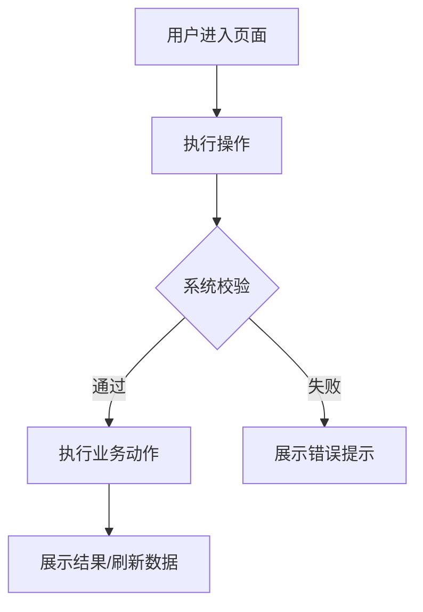

# PRD Output Contract

Read this file only after the final PRD confirmation summary is approved and immediately before writing or validating `prd.md` or `prd/00-index.md` plus its fragments.

## Representation rules

- Small form is `fp-docs/changes/<slug>/prd.md`; split form is `fp-docs/changes/<slug>/prd/00-index.md` plus indexed fragments. `prd.md` and `prd/` are mutually exclusive.
- Select the form before writing. For form selection, default to the small form when the complete logical artifact is expected to stay within 500 lines and 30,000 characters. Use split form only when the small form is expected to exceed either hard limit, the user explicitly approves split form, or an applicable target-project setting explicitly requires it. Multiple features, page areas, subsystems, change scopes, or ownership domains guide fragment boundaries after splitting; they do not trigger split form by themselves.

叙述性内容默认使用中文；代码、命令、路径、技术标识符、API 字段以及本模板要求精确匹配的英文 schema 标题保留必要英文。若用户或目标项目设置明确指定其他语言，按共享优先级执行。

- In split form, `00-index.md` contains navigation and the authoritative fragment manifest only. Every sibling Markdown fragment is listed exactly once using this schema:

```markdown
| Order | File | Kind | Owns |
| ---: | --- | --- | --- |
| 1 | `01-user-stories-and-goals.md` | requirements | sections 一 and related goals |
| 2 | `10-feature-example.md` | feature | complete section 3.1 |
```

- Write fragments directly on semantic boundaries. Logical concatenation in fragment manifest order must pass logical template validation against the mandatory structure below: each required heading/table has exactly one owner and appears in the same order.
- Keep each complete `3.N` feature block, including its five subsections, in one fragment. The owner of `3.N.5 原型` uniquely references `prototype.html`; indexes and other fragments do not duplicate that detail.

## Structure rules

- Keep every heading and table below in the exact order. Do not rename, merge, remove, reorder, or add top-level sections.
- Replace placeholders and add rows as needed. Repeat `3.2`, `3.3`, and later feature blocks with the same five subsections.
- Empty sections remain and say `不适用` or `无，原因：...`.
- Complex interactions require Mermaid. For a simple flow, explain in chapter 2 why no diagram is needed.
- `六、待确认问题` contains only non-blocking items; write `无` when empty.

````markdown
# <产品/功能名称> PRD

## 一、用户故事

### 1.1 用户故事

- 作为 <使用角色>，我想要 <能力/动作>，以便于 <业务价值>。

### 1.2 业务问题与预期目标

<业务问题、当前痛点、预期目标和成功状态。>

## 二、核心业务流程

<!-- 简单功能可说明无需流程图；复杂交互必须给 mermaid。 -->



## 三、功能需求

### 3.1 <功能名称>

#### 3.1.1 功能说明

<该功能做什么，解决哪个用户故事。>

#### 3.1.2 交互逻辑

- 用户点击 <操作>，系统显示 <反馈/弹窗/页面>。
- 用户输入 <内容>，系统执行 <校验/查询/提交>。
- 用户确认 <动作>，系统 <调用接口/刷新状态/记录日志>。

#### 3.1.3 异常处理

| 异常场景 | 触发条件 | 系统处理方式 | 用户提示 |
|---|---|---|---|
| <异常场景> | <条件> | <处理方式> | <提示文案> |

#### 3.1.4 页面元素

| 元素名 | 类型 | 说明 | 校验规则 |
|---|---|---|---|
| <元素名> | <输入框/选择器/按钮/表格/弹窗/其他> | <用途> | <必填/格式/长度/权限/状态> |

#### 3.1.5 原型

- 原型文件：`prototype.html`（如生成）
- 原型依据：<已有页面 / Figma / 截图 / UI/UX spec>
- 未生成原因：<如不需要原型>

## 四、非功能需求

### 4.1 性能要求

- 接口响应时间：<例如 P95 ≤ 2s，或按现有系统标准>
- 并发用户数：<例如支持 N 个并发用户/按现有容量>
- 数据量边界：<列表、分页、批量操作数量等>

### 4.2 安全需求

- 权限设计：<是否需要权限点，哪些角色可访问>
- 权限校验：<哪些操作需要前端置灰/隐藏，哪些必须后端校验>
- 数据安全：<敏感字段、越权、租户隔离、输入校验等>

### 4.3 操作日志记录

| 操作 | 是否记录日志 | 记录信息 |
|---|---|---|
| <操作名称> | 是/否 | 操作人、时间、对象、参数摘要、结果、失败原因等 |

## 五、测试建议

| 场景 | 前置条件 | 操作 | 预期结果 |
|---|---|---|---|
| <核心业务场景> | <条件> | <动作> | <结果> |
| <异常场景> | <条件> | <动作> | <结果> |
| <权限场景> | <条件> | <动作> | <结果> |

## 六、待确认问题

- <仅记录非阻塞问题；如果没有，写“无”。每条必须说明为什么不阻塞。>
````

## Structure self-review

- Exactly one canonical form exists: `fp-docs/changes/<slug>/prd.md` or `fp-docs/changes/<slug>/prd/00-index.md` plus indexed fragments; the mutually exclusive pair never coexists.
- For split form, the fragment manifest lists every sibling Markdown fragment exactly once with unique Order/File values and unique detailed ownership; every listed file exists and no unindexed fragment exists.
- Every Markdown file, including `00-index.md`, has at most 500 lines and 30,000 characters.
- All six required sections and required nested headings remain in order; no extra top-level section exists.
- Split-form logical template validation reads every fragment in manifest order and checks the same mandatory heading/table sequence as small form.
- Every feature block has 功能说明 / 交互逻辑 / 异常处理 / 页面元素 / 原型.
- Required tables retain their exact columns.
- User story, goal, requirements, exceptions, permissions, logs, and tests align.
- Complex flows have Mermaid; simple flows explain why no diagram is needed.
- Prototype decision is explicit; generated prototypes implement the confirmed core interactions.
- No `TBD`, `TODO`, `待补充`, `按需处理`, or `类似上面` remains.
