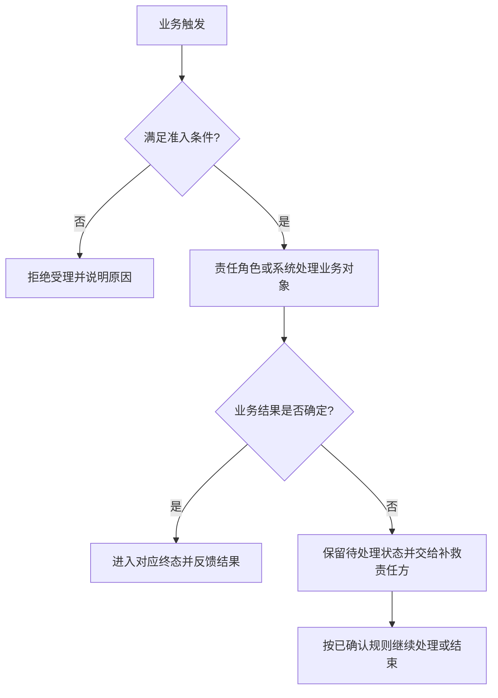

# PRD Output Contract

Read this file only after the final PRD confirmation summary is approved and immediately before writing or validating `prd.md` or `prd/00-index.md` plus its fragments.

## Representation rules

- Small form is `fp-docs/changes/<slug>/prd.md`; split form is `fp-docs/changes/<slug>/prd/00-index.md` plus indexed fragments. `prd.md` and `prd/` are mutually exclusive.
- Select the form before writing. For form selection, default to the small form when the complete logical artifact is expected to stay within 500 lines and 30,000 characters. Use split form only when the small form is expected to exceed either hard limit, the user explicitly approves split form, or an applicable target-project setting explicitly requires it. Multiple features, page areas, subsystems, change scopes, or ownership domains guide fragment boundaries after splitting; they do not trigger split form by themselves.

叙述性内容默认使用中文；代码、命令、路径、技术标识符、API 字段以及本模板要求精确匹配的英文 schema 标题保留必要英文。若用户或目标项目设置明确指定其他语言，按共享优先级执行。

- In split form, `00-index.md` contains navigation and the authoritative fragment manifest only. Every sibling Markdown fragment is listed exactly once using this schema:

```markdown
| Order | File | Kind | Owns |
| ---: | --- | --- | --- |
| 1 | `01-user-stories-and-goals.md` | requirements | sections 一 and related goals |
| 2 | `10-feature-example.md` | feature | complete section 3.1 |
```

- Write fragments directly on semantic boundaries. Logical concatenation in fragment manifest order must pass logical template validation against the mandatory structure below: each required heading/table has exactly one owner and appears in the same order.
- Keep each complete `3.N` feature block, including its four subsections, in one fragment. The owner of `3.N.4 原型` uniquely references the resolved native `prototype/manifest.json` and preview, or legacy `prototype.html`; indexes and other fragments do not duplicate that detail. Rendering/asset resolution follows `${CLAUDE_PLUGIN_ROOT}/skills/_shared/prototype-contract.md`, independently of PRD splitting.

## Structure rules

- Keep every heading and table below in the exact order. Do not rename, merge, remove, reorder, or add top-level sections.
- Replace placeholders and add rows as needed. Repeat `3.2`, `3.3`, and later feature blocks with the same four subsections.
- Empty sections remain and say `不适用` or `无，原因：...`.
- Complex interactions require Mermaid. For a simple flow, explain in chapter 2 why no diagram is needed.
- `六、待确认问题` contains only non-blocking items; write `无` when empty.
- 以下加粗内容标签属于现有章节内的写作槽位，不是新增标题或表格 schema。用已确认业务内容替换占位；适用性由 `fp-prd-grill-me` 的 Business-first analysis 决定。简单变化可简述不变/不适用及原因，新业务明确无现状；只保留适用的示例行，不套用示例中的业务步骤。
- 当前事实注明来源，用户决策注明确认依据，明确授权的假设在对应位置标注；跨功能共用流程/状态在唯一 owner 详述，其他功能引用，不复制。

````markdown
# <产品/功能名称> PRD

## 一、用户故事

### 1.1 用户故事

- 作为 <使用角色>，我想要 <能力/动作>，以便于 <业务价值>。

### 1.2 业务问题与预期目标

<业务问题、当前痛点、预期目标和可观察的成功状态；指标与阈值只使用已确认值。>

**本次范围**：<MVP 包含什么、不做什么，以及交付边界。>

## 二、核心业务流程

**现状流程**：<当前业务从触发到结果的链路、参与角色/系统及依据；新业务写“无现有流程”。>

**目标流程**：<业务触发、准入条件、处理责任、跨角色/系统交接、结束条件和结果反馈；没有变化的环节明确保留。>

<!-- 简单功能可说明无需流程图及理由；复杂交互按真实业务替换节点，覆盖关键分支，不套用示例流程。 -->


```mermaid
flowchart TD
    A[业务触发] --> B{满足准入条件?}
    B -->|否| C[拒绝受理并说明原因]
    B -->|是| D[责任角色或系统处理业务对象]
    D --> E{业务结果是否确定?}
    E -->|是| F[进入对应终态并反馈结果]
    E -->|否| G[保留待处理状态并交给补救责任方]
    G --> H[按已确认规则继续处理或结束]
```

**变化与影响**：<逐项说明入口/流程/规则/状态/展示的变化，以及受影响角色和用户端/后台/外部系统；“不变”须说明相关现有能力及证据如何满足目标流程，“不适用”须说明原因。>

## 三、功能需求

### 3.1 <功能名称>

#### 3.1.1 功能说明

<该功能做什么，解决哪个用户故事，承接第二章的哪个业务环节。>

**业务规则**：<谁在什么前置条件下可对哪个业务对象执行什么动作；关键字段、校验/额度/时间边界及冲突规则，按适用性写明；不写技术实现方案。>

#### 3.1.2 交互逻辑

**业务状态与流转**：<对有生命周期的对象逐项描述下列内容；无业务状态变化时写明理由，不拿 loading/empty/error 页面状态代替。>

- <当前业务状态>：触发条件 <事件与准入规则>；执行角色 <用户/运营/审核者/系统>；下一状态或退出条件 <结果/终态>；允许操作 <角色可做/不可做什么>；结果可见位置 <谁在哪里得知进展与结果>。

**页面与操作映射**：<将已确认规则和状态映射到页面；纯后台/API 需求说明对应的调用方可观察结果。>

- 用户执行 <操作>，满足 <业务规则/权限/状态> 时，系统 <受理/拒绝> 并显示 <反馈>。
- <角色/系统> 完成 <业务动作> 后，业务对象进入 <状态>，相关端展示 <一致的进展/结果和可用操作>。

#### 3.1.3 异常处理

| 异常场景 | 触发条件 | 系统处理方式 | 用户提示 |
|---|---|---|---|
| <异常场景> | <事件、前置状态与边界> | <停留/回退/进入的业务状态；补救责任与恢复/终止规则；是否允许重试/取消> | <对应角色看到的提示、可执行动作及最终结果查看位置> |

#### 3.1.4 原型

- 原型模式：<project-native / standalone-html / 不生成>
- 原型入口：<native 为 prototype/manifest.json 与 prototype/preview/index.html；legacy 为 prototype.html；填写实际相对链接，注明原型仅保留本地、不随 Git 提交>
- 源码与基座：<native 源码/Mock 入口、baseReference 版本；legacy 写不适用>
- 预览与验证：<已验证的本地命令/URL、场景、实际检查及限制；Mock 不等于真实 E2E>
- 原型依据：<项目真实组件/基座 / 已有页面 / Figma / 截图 / UI/UX spec>
- 未生成原因：<如不需要原型>

## 四、非功能需求

### 4.1 性能要求

- 接口响应时间：<例如 P95 ≤ 2s，或按现有系统标准>
- 并发用户数：<例如支持 N 个并发用户/按现有容量>
- 数据量边界：<列表、分页、批量操作数量等>

### 4.2 安全需求

- 权限设计：<是否需要权限点，哪些角色可访问>
- 权限校验：<哪些操作需要前端置灰/隐藏，哪些必须后端校验>
- 数据安全：<敏感字段、越权、租户隔离、输入校验等>

### 4.3 操作日志记录

| 操作 | 是否记录日志 | 记录信息 |
|---|---|---|
| <操作名称> | 是/否 | 操作人、时间、对象、参数摘要、结果、失败原因等 |

## 五、测试建议

| 场景 | 前置条件 | 操作 | 预期结果 |
|---|---|---|---|
| <核心业务场景> | <角色、业务状态、准入条件> | <触发并完成业务链路> | <最终业务结果及各端可见反馈> |
| <状态/规则边界> | <前置状态、权限及边界值> | <合法/非法操作或跨角色交接> | <允许/拒绝结果、下一状态及操作权限> |
| <异常场景> | <失败/中断/结果未知的前置条件> | <触发异常并按规则补救> | <业务停留/恢复/结束状态、补救责任与用户反馈> |
| <权限场景> | <无权角色/不可见对象> | <尝试查询或操作> | <拒绝且业务数据不被越权改变> |
| <不改链路回归> | <声明沿用的现有能力及输入> | <执行受本次变更影响的原有链路> | <既有行为与新流程兼容的可观察结果> |

## 六、待确认问题

- <仅记录非阻塞问题；如果没有，写“无”。每条必须说明为什么不阻塞。>
````

## Structure self-review

- Exactly one canonical form exists: `fp-docs/changes/<slug>/prd.md` or `fp-docs/changes/<slug>/prd/00-index.md` plus indexed fragments; the mutually exclusive pair never coexists.
- For split form, the fragment manifest lists every sibling Markdown fragment exactly once with unique Order/File values and unique detailed ownership; every listed file exists and no unindexed fragment exists.
- Every Markdown file, including `00-index.md`, has at most 500 lines and 30,000 characters.
- All six required sections and required nested headings remain in order; no extra top-level section exists.
- Split-form logical template validation reads every fragment in manifest order and checks the same mandatory heading/table sequence as small form.
- Every feature block has 功能说明 / 交互逻辑 / 异常处理 / 原型.
- Required tables retain their exact columns.
- User story, goal, requirements, exceptions, permissions, logs, and tests align.
- Complex flows have Mermaid; simple flows explain why no diagram is needed.
- Prototype decision is explicit; generated prototypes implement the confirmed core interactions.
- No `TBD`, `TODO`, `待补充`, `按需处理`, or `类似上面` remains.

## Business-closure self-review

- **拿掉页面仍可解释业务**：现状与依据、目标链路、变更点、角色/系统责任、MVP/不做范围和业务结果明确；新业务和简单变化给出适用性说明。
- **状态与规则闭环**：适用的每个业务状态都有进入触发、执行者、允许操作、退出/下一状态和结果可见位置；不存在无说明的死路或只用页面状态替代业务状态。规则有前置条件、判断边界和处理结果。
- **异常形成业务闭环**：关键失败/中断/未知结果不只给提示，还说明业务对象去向、恢复或终止条件、补救责任及反馈；异步/重复操作场景按适用性覆盖，未确认策略无法自行补齐。
- **不改结论可追溯**：后台/外部系统不改有具体能力和证据支撑，能满足新流程；估计、旧文档或未验证源码不能成为已确认事实。授权假设清楚标注，不冒充验证结论。
- **页面与验收对齐**：页面/原型反映已确认状态与规则；第五章覆盖核心链路、状态/规则边界、相关异常、权限、跨角色交接和不改链路回归，结果可观察且与目标一致。只验证点击和提示不算业务验收。
- **确认仍有效**：原型只证明已演示部分；新增的阻塞产品问题返回 `fp-prd-grill-me`，更新摘要获批后再修订。第六章只含有明确非阻塞理由的问题，不以填满模板替代产品确认。
